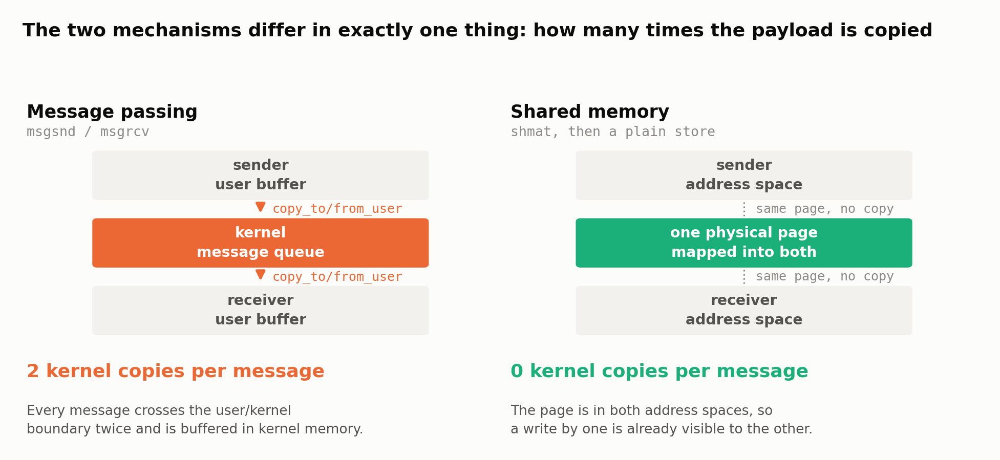
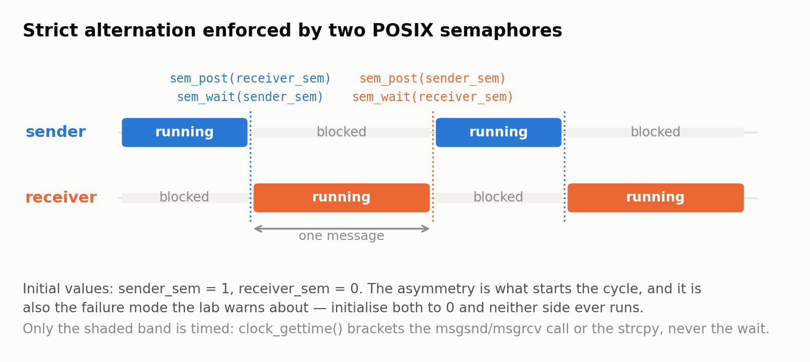

# Two Ways to Move a Byte Between Processes

### Operating Systems (2025) · Lab 1 · NCKU CSIE

**A sender and a receiver that exchange the same messages twice — once through
a System V message queue, once through shared memory — behind one interface, so
the cost of the kernel round trip can be measured rather than assumed.**

<p>
  
  
  
  
</p>

---

## Abstract

Two processes that need to exchange data have a choice: hand the bytes to the
kernel and let it deliver them, or arrange for both processes to be looking at
the same physical page. The first is **message passing**; the second is
**shared memory**. Every operating systems textbook says the second is faster.
This project implements both behind a single `mailbox_t` abstraction, drives
them with the same input, and measures the difference.

Measured over 100 messages, shared memory completes the transfers in **13.4 µs
against 172.4 µs — 12.9× faster** ([`docs/results.md`](docs/results.md),
reproducible with [`scripts/benchmark.sh`](scripts/benchmark.sh)). §6 explains
why part of that gap is an artifact of how the benchmark is written, which is
more interesting than the headline number.

---

## Contents

- [1. The two mechanisms](#1-the-two-mechanisms)
- [2. One interface, two implementations](#2-one-interface-two-implementations)
- [3. Synchronisation](#3-synchronisation)
- [4. Measuring only what should be measured](#4-measuring-only-what-should-be-measured)
- [5. Results](#5-results)
- [6. Discussion and limitations](#6-discussion-and-limitations)
- [7. Building and running](#7-building-and-running)
- [8. References](#8-references)

---

## 1. The two mechanisms

<div align="center">
<picture>
  <source media="(prefers-color-scheme: dark)"  srcset="docs/figures/fig1-datapath-dark.png">
  <source media="(prefers-color-scheme: light)" srcset="docs/figures/fig1-datapath-light.png">
  
</picture>
</div>

> **Figure 1.** The mechanisms differ in one thing that matters: how many times
> the payload crosses the user/kernel boundary.

**Message passing** (`msgsnd` / `msgrcv`) is a kernel-mediated copy. The sender
traps into the kernel, the kernel copies the message out of the sender's
address space into a queue it owns, and later copies it into the receiver's
buffer. Two system calls, two copies, and kernel memory held for the message in
between. In exchange the kernel provides the queue, the buffering and the
blocking semantics for free.

**Shared memory** (`shmget` / `shmat`) is not a transfer at all. The kernel maps
one physical page into both address spaces; after that a write by one process is
already visible to the other, because it is the same memory. There is no system
call on the data path. The price is that the kernel no longer knows when a
message has been written, so the processes must synchronise themselves.

That trade — *the kernel does less, so the programmer must do more* — is the
whole content of this lab.

---

## 2. One interface, two implementations

The lab supplies a `mailbox_t` whose `flag` selects the mechanism and whose
`storage` union holds whichever handle that mechanism needs:

```c
typedef struct {
    int flag;                 /* 1 = message passing, 2 = shared memory */
    union {
        int   msqid;          /* message queue id, from msgget()        */
        char *shm_addr;       /* mapped address,   from shmat()         */
    } storage;
} mailbox_t;
```

`send()` and `receive()` branch on the flag, and that branch is the only place
in the program that knows which mechanism is in use:

```c
void send(message_t message, mailbox_t *mailbox_ptr)
{
    if (mailbox_ptr->flag == MSG_PASSING) {
        clock_gettime(CLOCK_MONOTONIC, &start);
        msgsnd(mailbox_ptr->storage.msqid, &message, sizeof(message.msgText), 0);
        clock_gettime(CLOCK_MONOTONIC, &end);
    } else if (mailbox_ptr->flag == SHARED_MEM) {
        clock_gettime(CLOCK_MONOTONIC, &start);
        strcpy(mailbox_ptr->storage.shm_addr, message.msgText);   /* just a store */
        clock_gettime(CLOCK_MONOTONIC, &end);
    }
    time_taken += (end.tv_sec - start.tv_sec) + (end.tv_nsec - start.tv_nsec) / 1e9;
}
```

The asymmetry is visible in the source: one branch is a system call, the other
is a library `memcpy`.

Both processes name the same kernel object through `ftok("receiver.c", 'B')`,
which hashes a file's inode number and a project byte into a `key_t`. Sender and
receiver derive the same key from the same file, so `msgget` and `shmget` return
handles to the same object without the two programs having to agree on a
numeric id.

---

## 3. Synchronisation

Neither mechanism, on its own, tells the receiver that a message is ready.
Message queues block on an empty queue, but shared memory offers nothing — the
receiver would happily read a stale or half-written buffer. The program
therefore enforces strict alternation with two named POSIX semaphores, and uses
the same protocol for both mechanisms so the comparison stays honest.

<div align="center">
<picture>
  <source media="(prefers-color-scheme: dark)"  srcset="docs/figures/fig2-handshake-dark.png">
  <source media="(prefers-color-scheme: light)" srcset="docs/figures/fig2-handshake-light.png">
  
</picture>
</div>

> **Figure 2.** Exactly one of the two processes is runnable at any moment.

```c
sender_sem   = sem_open("/sender_sem",   O_CREAT, 0644, 1);   /* starts unlocked */
receiver_sem = sem_open("/receiver_sem", O_CREAT, 0644, 0);   /* starts locked   */
```

The **initial values carry the entire protocol**. `sender_sem` starts at 1 so
the sender may proceed immediately; `receiver_sem` starts at 0 so the receiver
blocks until the first message exists. Initialise both to 0 and the program
deadlocks before doing any work — the failure the lab notes explicitly, and one
that looks like a hang rather than an error.

Termination is in-band: at EOF the sender transmits the literal string `exit`,
and the receiver breaks its loop on receiving it. The receiver then destroys the
kernel object with `IPC_RMID`, because System V IPC objects outlive the
processes that created them and would otherwise persist until reboot.

---

## 4. Measuring only what should be measured

The lab is specific that blocking time must not be counted, and this is the part
of the exercise that is easy to get wrong. Wrapping the whole `while` loop would
measure how long each process spent waiting for the other — a number that says
nothing about either mechanism and is dominated by scheduler latency.

`clock_gettime(CLOCK_MONOTONIC, …)` therefore brackets only the transfer itself:
the `msgsnd`/`msgrcv` call, or the `strcpy` into the mapped page. The
`sem_wait` that precedes it sits outside the timed region. `CLOCK_MONOTONIC`
rather than `CLOCK_REALTIME` matters too — the latter can step backwards when
the system clock is adjusted, which would silently corrupt a microsecond-scale
measurement.

---

## 5. Results

Totals over 100 messages, mean of 5 runs, produced by
[`scripts/benchmark.sh`](scripts/benchmark.sh). Full output and environment in
[`docs/results.md`](docs/results.md).

| Mechanism | send | receive |
| --- | ---: | ---: |
| Message passing (System V message queue) | 172.4 µs | 178.4 µs |
| Shared memory (System V shared memory) | **13.4 µs** | **14.6 µs** |
| **Ratio** | **12.9×** | **12.2×** |

Per message: **1.72 µs versus 0.13 µs** on the sending side. The prediction
holds, and the size of the gap is roughly what two system calls plus two kernel
copies cost.

---

## 6. Discussion and limitations

**The benchmark is biased, and the bias is worth more than the headline.**
`msgsnd` is called with `sizeof(message.msgText)`, so every message passing call
transfers the full **1024-byte** buffer. The shared memory path uses `strcpy`,
which stops at the terminating NUL — about **19 bytes** for this input. The two
mechanisms are not moving the same number of bytes; roughly 51× more data goes
through the queue.

The result survives the objection, but the reading changes. Message passing
moves 51× the payload and is only 13× slower, which means the cost is dominated
by the fixed price of the system calls and the boundary crossings, not by the
bytes. Passing `strlen(msgText) + 1` would isolate mechanism from payload and is
the first change I would make.

**A 1024-byte message overflows the buffer.** The specification allows messages
of 1 to 1024 bytes, `msgText` is `char[1024]`, and the shared memory path uses
`strcpy`, which writes `strlen + 1` bytes. A maximal-length line therefore
writes 1025 bytes into a 1024-byte region. The test input never comes close, so
the bug is latent — `strncpy` with an explicit length, or carrying the length in
the message struct, is the fix.

**`ftok("receiver.c", 'B')` ties the program to its own source tree.** The key
is derived from the inode of a source file, so both processes must run with
`receiver.c` present at that relative path. Move the binaries, or run from
another directory, and `ftok` fails. A fixed key constant, or a path under
`/tmp` created by the program, would not have this coupling.

**IPC objects leak if the receiver does not finish.** Cleanup happens only on
the receiver's normal exit path. Kill it mid-run and the message queue or shared
segment stays in the kernel until `ipcrm` removes it — a property of System V
IPC rather than of this code, but one the program could defend against by
installing a `SIGINT` handler.

**Strict alternation is not what shared memory is for.** Forcing a full
round-trip per message means the mapped page never holds more than one message,
so the mechanism's real advantage — a ring buffer that lets the sender run ahead
of the receiver — is deliberately given up in order to keep the two mechanisms
comparable. Measuring shared memory with a proper ring buffer against a message
queue would be a more interesting experiment, and would widen the gap
considerably.

---

## 7. Building and running

```bash
make                    # builds ./sender and ./receiver
```

Two terminals, receiver first — it must be waiting before the sender starts:

```bash
./receiver 1            # terminal A:  1 = message passing, 2 = shared memory
./sender   1 input.txt  # terminal B
```

Both print their total communication time on exit. To reproduce the table in §5:

```bash
./scripts/benchmark.sh 5     # 5 runs of each mechanism
```

If a run is interrupted, clear any orphaned kernel objects before the next one:

```bash
ipcs                    # list message queues and shared segments
ipcrm -a                # remove the ones owned by you
```

---

## 8. References

1. A. Silberschatz, P. Galvin, G. Gagne. *Operating System Concepts.*
   Chapter 3, Interprocess Communication.
2. `man 7 sysvipc`, `man 2 msgget`, `man 2 msgsnd`, `man 2 shmget`,
   `man 2 shmat`, `man 3 sem_open`, `man 3 ftok`.
3. W. R. Stevens, S. A. Rago. *Advanced Programming in the UNIX Environment*,
   3rd ed. Chapter 15, Interprocess Communication.

---

## Provenance

Implementation by **部政佑 (Cheng-Yu Pu)** — Department of Computer Science and
Information Engineering, National Cheng Kung University
([github.com/pukyle](https://github.com/pukyle)).

Written for *Operating Systems* (2025), Lab 1, NCKU CSIE. The `mailbox_t`
structure, the header skeletons and `input.txt` come from the course template;
`sender.c`, `receiver.c` and the benchmark are mine. The lab handout is not
redistributed here.

Released under the [MIT License](LICENSE).
